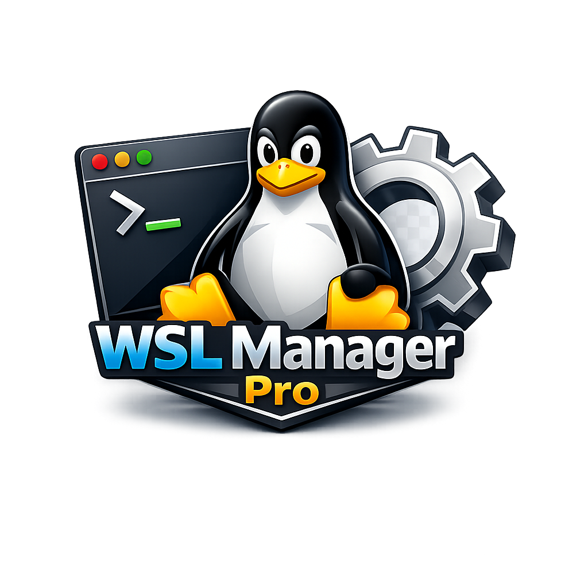
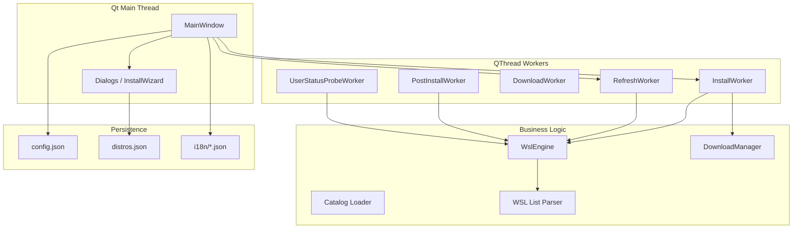

# WSL Manager Pro

<div align="center">
  
  <h1>WSL Manager Pro</h1>
  <p align="center">
    <a href="https://github.com/wilkinbarban/WSL-Manager-Pro/actions/workflows/ci.yml"></a>
    <a href="https://www.gnu.org/licenses/gpl-3.0"></a>
    <a href="https://www.python.org/downloads/"></a>
    <a href="https://pypi.org/project/PySide6/"></a>
    <a href="https://www.microsoft.com/windows"></a>
    <a href="https://github.com/wilkinbarban/WSL-Manager-Pro/releases"></a>
  </p>
</div>

---

> **Available in:** [English](README.md) · [Español](README_es.md) · [Português](README_br.md)

---

A **Windows desktop application** that centralises the management of
**Windows Subsystem for Linux (WSL)**: list distributions, install from the
online catalogue or from a downloaded rootfs, import/export, post-install
provisioning (user account, packages, `wsl.conf`), resource limits via
`.wslconfig`, and maintenance utilities.

**Application version:** 1.0.0

---

## Table of Contents

- [System Requirements](#system-requirements)
- [Technologies](#technologies)
- [Quick Start](#quick-start)
- [Repository Structure](#repository-structure)
- [How the Application Runs](#how-the-application-runs)
- [Architecture and Data Flow](#architecture-and-data-flow)
- [Code Modules](#code-modules)
  - [Entry Point (`main.py`)](#entry-point-mainpy)
  - [Core Package (`core/`)](#core-package-core)
  - [Utilities Package (`utils/`)](#utilities-package-utils)
  - [UI Package (`ui/`)](#ui-package-ui)
- [The `distros.json` Catalogue](#the-distrosjson-catalogue)
- [Persistent Configuration](#persistent-configuration)
- [User Interface Features](#user-interface-features)
- [WSL Engine (`WslEngine`)](#wsl-engine-wslengine)
- [Download Manager (`DownloadManager`)](#download-manager-downloadmanager)
- [Background Workers (Qt)](#background-workers-qt)
- [Internationalisation (i18n)](#internationalisation-i18n)
- [Observability (Logging & Diagnostics)](#observability-logging--diagnostics)
- [Privileges and Security](#privileges-and-security)
- [Build & Distribution](#build--distribution)
- [Development, Testing & CI](#development-testing--ci)
- [Roadmap](#roadmap)
- [License](#license)

---

## System Requirements

| Requirement | Details |
|-------------|---------|
| **Operating System** | Windows 10 build 19041+ (WSL 2 support) |
| **WSL** | `wsl.exe` accessible at `%SystemRoot%\System32\wsl.exe` |
| **PowerShell** | `pwsh.exe` (PS 7+) or `powershell.exe` (PS 5.1) on PATH |
| **Python** | 3.10 or later (uses modern type annotations: `list[str]`, `dict[str, str]`) |
| **Permissions** | Administrator privileges are recommended for WSL operations and winget. The application supports limited (read-only) mode if the user declines elevation. |

---

## Technologies

| Area | Technology |
|------|------------|
| Language | **Python 3.10+** |
| GUI framework | **PySide6** (official Qt 6 bindings for widgets) |
| UI concurrency | **QThread** + Qt signals/slots |
| HTTP client | **requests** (streaming downloads with retry and Range support) |
| Compression | **zstandard** (Arch Linux `.tar.zst` bootstrap --- avoids relying on system `tar --zstd` on Windows) |
| Data format | **JSON** (`distros.json`, `config.json`, i18n catalogues) |
| System integration | **subprocess** (`wsl.exe`, PowerShell, winget); **ctypes** (UAC elevation); **zipfile** / **tarfile** (archive handling) |
| Styling | Dark theme via QSS stylesheet (`resources/styles/dark.qss`) |

---

## Quick Start

### One-Click Installation (PowerShell)

#### Option A — You already have the repository cloned or downloaded

```powershell
Set-ExecutionPolicy -Scope Process -ExecutionPolicy Bypass -Force; .\install.ps1
```

#### Option A2 — Direct bootstrap without cloning (download + run install.ps1)

```powershell
Set-ExecutionPolicy -Scope Process -ExecutionPolicy Bypass -Force; irm https://raw.githubusercontent.com/wilkinbarban/WSL-Manager-Pro/master/install.ps1 | iex
```

#### Option B — Secure remote install (clones repo to Desktop, then delegates to install.ps1)

```powershell
Set-ExecutionPolicy -Scope Process -ExecutionPolicy Bypass -Force; irm https://raw.githubusercontent.com/wilkinbarban/WSL-Manager-Pro/master/install_secure.ps1 | iex
```

`install_secure.ps1` downloads the repository to `%USERPROFILE%\Desktop\WSL-Manager-Pro`
by default, verifies critical files, and delegates to `install.ps1` locally for
the fully automated environment setup.

### Manual Installation (classic alternative)

```powershell
# 1. Clone or download the repository
git clone https://github.com/wilkinbarban/WSL-Manager-Pro.git
cd WSL-Manager-Pro

# 2. Create and activate a virtual environment
python -m venv .venv
.\.venv\Scripts\activate

# 3. Install runtime dependencies
pip install -r requirements.txt

# 4. Run the application
python main.py
```

---

## Repository Structure

```
WSL Manager Pro/
+-- main.py                     # Entry point: path, elevation, QApplication, MainWindow
+-- pyproject.toml              # Metadata, dependencies, ruff and pytest configuration
+-- requirements.txt            # Runtime dependencies
+-- distros.json                # Static distro catalogue (URLs, package managers, post-install)
+-- ROADMAP.md                  # Multi-phase development plan (150+ tasks)
+-- build.ps1                   # PyInstaller build trigger (single EXE)
+-- install.ps1                 # One-click environment installer
+-- wsl_manager_pro.spec        # PyInstaller spec file
+-- wsl_manager_pro.rc          # Windows resource file (icon embedding)
¦
+-- core/                       # Business logic
¦   +-- __init__.py
¦   +-- wsl_engine.py           # Facade over wsl.exe, PowerShell, post-install, .wslconfig
¦   +-- wsl_list_parser.py      # Pure parsers for wsl --list output (testable without WSL)
¦   +-- downloader.py           # Resumable HTTP downloads + checksum verification
¦   +-- catalog_loader.py       # Catalogue validation, loading, and remote merge
¦   +-- constants.py            # Timeout, retry, chunk-size, and UI-limit constants
¦
+-- utils/                      # Cross-cutting services
¦   +-- __init__.py
¦   +-- config_manager.py       # Persistent JSON config (%APPDATA%\WSLManagerPro\config.json)
¦   +-- app_logging.py          # Rotating file logger
¦   +-- i18n.py                 # Runtime i18n (en/es/pt) with live switching
¦   +-- diagnostic_bundle.py    # ZIP diagnostic bundle generator
¦   +-- worker_threads.py       # QThread workers: refresh, install, download, etc.
¦
+-- ui/                         # PySide6 graphical interface
¦   +-- __init__.py
¦   +-- main_window.py          # QMainWindow: tabs, toolbar, workers, logging
¦   +-- dialogs.py              # Modal dialogs + 5-page Install Wizard
¦   +-- icons.py                # Programmatic status icons (circles) for the Dashboard
¦   +-- theme.py                # Centralised UI colour constants
¦   +-- tabs/                   # Extracted tab widgets (ROADMAP phase A)
¦       +-- __init__.py
¦       +-- dashboard_tab.py    # Distro status table with refresh and user probing
¦       +-- manage_tab.py       # Import/export and quick actions
¦       +-- settings_tab.py     # Paths, startup options, WSL2 resource limits
¦
+-- resources/                  # Bundled assets
¦   +-- i18n/
¦   ¦   +-- en.json             # English translations (500+ keys)
¦   ¦   +-- es.json             # Spanish translations
¦   ¦   +-- pt.json             # Portuguese (Brazilian) translations
¦   +-- styles/
¦       +-- dark.qss            # Dark Qt stylesheet (~250 lines)
¦
+-- assets/                     # Application icons
¦   +-- icon.ico
¦   +-- icon.png
¦
+-- tests/                      # Unit tests (32 tests, no WSL required)
¦   +-- __init__.py
¦   +-- test_app_logging.py
¦   +-- test_catalog_loader.py
¦   +-- test_config_manager.py
¦   +-- test_diagnostic_bundle.py
¦   +-- test_dialogs.py
¦   +-- test_downloader.py
¦   +-- test_i18n.py
¦   +-- test_wsl_engine.py
¦   +-- test_wsl_list_parser.py
¦
+-- docs/                       # Design documents
    +-- adrs/
        +-- 0001-qprocess-vs-subprocess.md
```

---

## How the Application Runs

1. **Path setup** --- `main.py` inserts the project root into `sys.path` so
   that absolute imports (`core`, `utils`, `ui`) work regardless of the
   working directory.
2. **Venv fallback** --- If PySide6 is not available in the current interpreter,
   the script attempts to relaunch using `.venv\Scripts\python.exe`.
3. **Dependency check** --- Detects missing packages and shows an error dialog
   with installation commands if any are absent.
4. **Qt bootstrap** --- Creates `QApplication`, applies DPI-aware font scaling,
   loads the dark stylesheet (`dark.qss`), and sets the application icon.
5. **Logging** --- `configure_logging()` attaches a rotating handler at
   `%LOCALAPPDATA%\WSLManagerPro\logs\app.log`.
6. **Config & i18n** --- Loads `ConfigManager` (auto-saves on schema migration)
   and initialises the language manager with the persisted preference.
7. **Admin elevation** --- If not running as administrator and the configuration
   requests it, the user is prompted to relaunch elevated. Choosing "No"
   disables `run_as_admin` and continues in limited mode.
8. **MainWindow** --- Creates and shows the main application window.
9. **Event loop** --- Enters `app.exec()` and runs until the window is closed.

```powershell
python main.py
```

---

## Architecture and Data Flow



- The **UI never blocks** on long operations --- all heavy work is delegated
  to **QThread workers** that communicate via Qt signals.
- **`WslEngine`** is the sole module that launches OS processes. It decodes
  output (UTF-16 LE for meta-commands, UTF-8 for bash).
- **`DownloadManager`** supports HTTP resume, checksum verification, and
  multi-format extraction (APPX, Arch bootstrap).
- **`Catalog Loader`** validates and merges local + remote catalogues.
- **`ConfigManager`** persists settings, download states, and the registry
  of installed distros.

---

## Code Modules

### Entry Point (`main.py`)

Key functions: `_is_admin()`, `_elevate_windows()`,
`_relaunch_with_workspace_venv()`, `_load_dark_stylesheet()`,
`_detect_missing_runtime_dependencies()`, `_resource_path()`, `main()`.

The `main()` function executes a 13-step bootstrap: app ID -> PySide6 import ->
QApplication -> dependency check -> font scaling -> dark stylesheet -> icon ->
logging -> config -> i18n -> admin prompt -> MainWindow -> event loop.

### Core Package (`core/`)

**`core/constants.py`** --- Centralised timeout, retry, chunk-size, and UI-limit
constants used by all other modules.

**`core/wsl_engine.py`** --- `WslEngine`: high-level facade over `wsl.exe`,
winget, DISM, and PowerShell.  Data models: `DistroInfo`, `OnlineDistro`.
Exceptions: `WslNotFoundError`, `WslCommandError`.  Provides distro lifecycle
operations (import/export/unregister/set-default/terminate/shutdown), real-time
command execution (`run_command`/`run_command_as_root`), post-install
provisioning pipeline (`build_post_install_steps`/`inject_post_install`)
supporting apt/dnf/zypper/pacman/apk, and `.wslconfig` generation.  Passwords
are written via a temporary file inside the guest and deleted immediately after
`chpasswd` --- never visible via `ps`.

**`core/wsl_list_parser.py`** --- Pure functions (no subprocess dependency):
`parse_wsl_list_verbose()` and `parse_wsl_list_online()`.  Handle UTF-16 LE
BOM, localised headers (en/es/pt), and the `*` default marker.  Unit-testable
on any OS.

**`core/downloader.py`** --- `DownloadManager`: streaming HTTP download with
Range resume, up to 3 retries, progress callback, checksum verification
(SHA-256/SHA-512/MD5), and cooperative cancellation via `threading.Event`.
Also: `extract_appx()` for APPX/ZIP archives and `extract_arch_bootstrap()`
for `.tar.zst` (zstandard decompression -> repack as plain `tar.gz`).

**`core/catalog_loader.py`** --- `CatalogLoadResult` dataclass.  `load_catalog()`
validates and merges local + remote distro catalogues.  Invalid entries are
skipped with warnings rather than aborting.

### Utilities Package (`utils/`)

**`utils/config_manager.py`** --- `ConfigManager`: persistent JSON at
`%APPDATA%\WSLManagerPro\config.json`.  `AppConfig` dataclass with all
settings.  Schema v1->v2 migration with auto-save.  `InstalledDistro` and
`DownloadState` data models.  Strict validation on save, lenient loading
with fallbacks.

**`utils/app_logging.py`** --- Rotating file handler: 2 MB maximum, 5 backups,
UTF-8 encoding.  Password sanitisation enforced by convention at all call
sites.

**`utils/i18n.py`** --- `I18nManager` singleton with `language_changed` Qt
signal for live UI switching.  Fallback chain: current language -> English ->
raw key.  Supports `str.format(**kwargs)`.  PyInstaller-compatible resource
resolution.

**`utils/diagnostic_bundle.py`** --- ZIP generator: `README.txt`, `log_tail.txt`,
`wsl_version.txt`, `wsl_status.txt`.  No secrets by design.

**`utils/worker_threads.py`** --- 12 QThread worker classes: `BaseWorker`,
`CancellableWorker`, `RefreshWorker`, `UserStatusProbeWorker`,
`WslCommandWorker`, `ExportWorker`, `ImportWorker`, `DownloadWorker`,
`PostInstallWorker`, `InstallWorker` (full 5-step pipeline + `wsl_online`
alternative), `WslConfigWorker`, `WingetInstallWorker`.

### UI Package (`ui/`)

**`ui/main_window.py`** --- `MainWindow` (QMainWindow): toolbar (Install,
Refresh, Shutdown All, language selector), 3-tab splitter + log console,
auto-refresh timer (configurable, minimum 15 s), distro catalogue building
(merges `wsl --list --online` with `distros.json` metadata), context menu on
the Dashboard table, full install wizard flow with external PowerShell support
for legacy distros.  `closeEvent` terminates tracked processes.

**`ui/dialogs.py`** --- Modal dialogs: `UserCreationDialog` (username regex
`^[a-z_][a-z0-9_-]{0,30}$`, password = 4 chars, sudo checkbox),
`DirectoryDialog`, `SwapConfigDialog`, and `InstallWizard` (5-page guided
flow: Distro Selection -> Paths -> User Account -> Summary -> Progress).  The
wizard supports profile save/load and legacy interactive distro detection.

**`ui/icons.py`** --- Programmatic `QIcon` factory via `QPainter`: running
(green), stopped (grey), installing (orange), default (blue).

**`ui/theme.py`** --- 9 named colour constants: `COLOR_TEXT`, `COLOR_MUTED`,
`COLOR_INFO`, `COLOR_SUCCESS`, `COLOR_WARNING`, `COLOR_ERROR`, `COLOR_ACCENT`,
`COLOR_STOPPED`, `COLOR_BG_PANEL`.

**`ui/tabs/`** --- Decoupled tab widgets (ROADMAP phase A):
- `DashboardTab` --- 7-column distro table with header controls.
- `ManageTab` --- Import/export and quick-action buttons.
- `SettingsTab` --- Paths, startup options, WSL2 limits, diagnostics.

---

## The `distros.json` Catalogue

A static JSON catalogue in the project root. Each key is an internal distro ID
(e.g. `ubuntu-2404`) and each value is an object with these fields:

| Field | Type | Description |
|-------|------|-------------|
| `display_name` | `string` | Human-readable name for the UI |
| `description` | `string` | Short description |
| `url` | `string` | Rootfs download URL (required for `rootfs` method) |
| `checksum_url` | `string?` | URL of the checksum index file |
| `checksum_file_pattern` | `string?` | Filename pattern to match in the checksum file |
| `algo` | `string?` | Hash algorithm: `sha256`, `sha512`, `md5` |
| `pkg_manager` | `string?` | `apt`, `dnf`, `zypper`, `pacman`, `apk` |
| `sudo_group` | `string?` | `sudo` (Debian/Ubuntu) or `wheel` (Fedora/Arch/Alpine) |
| `packages` | `string[]?` | Default packages installed during post-install |
| `extract_type` | `string` | Archive format: `tar.gz`, `tar`, `tar.xz`, `tar.zst`, `appx`, `zip` |
| `systemd` | `boolean?` | Whether systemd boot support is available |
| `install_method` | `string` | `rootfs` (download + import) or `wsl_online` (Store catalogue) |
| `online_name` | `string?` | Exact name in `wsl --list --online` (required for `wsl_online`) |
| `legacy_non_interactive_disable` | `boolean?` | Marks distros requiring interactive first-boot (Oracle, SUSE) |
| `winget_id` | `string?` | Windows Package Manager identifier (reserved for future UI use) |
| `notes` | `string?` | Free-form maintainer notes |

**Bundled distributions:** Ubuntu 22.04/24.04 LTS, Debian 12, Fedora 40,
Alpine Linux 3.19, Arch Linux, AlmaLinux 9, SUSE Linux Enterprise 15 SP6,
Oracle Linux 9.5.

---

## Persistent Configuration

**File:** `%APPDATA%\WSLManagerPro\config.json`

| Setting | Default | Description |
|---------|---------|-------------|
| `language` | `"en"` | UI language (`en`, `es`, `pt`) |
| `install_dir` | `C:\WSL\Distros` | Default installation directory |
| `download_dir` | `C:\WSL\Cache` | Download cache directory |
| `remote_catalog_url` | `""` | Optional remote catalogue URL |
| `run_as_admin` | `true` | Whether to prompt for elevation on startup |
| `check_for_updates` | `false` | Check for updates on startup (GitHub releases) |
| `memory_limit_gb` | `4` | WSL 2 VM memory limit (1---256 GB) |
| `swap_size_gb` | `2` | WSL 2 swap space (0---128 GB) |
| `processors` | `2` | Logical CPU cores for WSL 2 (1---256) |
| `localhost_forwarding` | `true` | Port forwarding from Windows to WSL |
| `vm_idle_timeout_sec` | `60` | VM auto-shutdown idle timeout |
| `auto_refresh_interval_sec` | `15` | Dashboard auto-refresh interval |
| `wsl_version` | `2` | Preferred WSL version (1 or 2) |
| `diagnostic_log_tail_lines` | `200` | Log lines included in diagnostic ZIP |
| `download_states` | `{}` | Resume metadata for partial downloads |
| `installed_distros` | `[]` | Registry of distros installed by this app |

---

## User Interface Features

### Toolbar

- **Install** --- Opens the 5-page Install Wizard.
- **Refresh** --- Refreshes the distro list.
- **Shutdown All** --- Runs `wsl --shutdown`.
- **Language selector** --- Switches UI language live (en / es / pt).

### Dashboard Tab

- 7-column table: status icon, name, state, WSL version, default marker,
  user configuration status, action button.
- Manual Refresh and Auto-Refresh (configurable interval, minimum 15 s).
- Re-scan User Status button for probing default users.
- Right-click context menu: Set Default, Terminate, Export, Open Shell
  (user/root), Full System Update, Repair (conditional), Unregister.
- Empty state with Retry Detection when WSL is unavailable.

### Manage Tab

- **Import:** tar path, WSL name, install directory ? `wsl --import`.
- **Export:** distro selector + save path ? `wsl --export`.
- **Quick Actions:** Set Default, Terminate, Shutdown All, Open Shell
  (user/root), Full System Update, Install via winget, Repair (Oracle/SUSE),
  Unregister, Deep Clean.

### Settings Tab

- Default installation and download directories.
- Startup options: run as admin, check for updates, update repo URL.
- WSL 2 resource limits: memory, swap, processors, localhost forwarding,
  VM idle timeout (advanced toggle).
- **Apply & Write .wslconfig** button (worker in background).
- **Export Diagnostic Bundle** button (ZIP with app version, log tail,
  `wsl --version`, `wsl --status`).
- **Save Settings** button (persists to `config.json`).

### Install Wizard

- **Page 1** --- Select distro from merged catalogue (local + online).
- **Page 2** --- Configure paths and WSL name.
- **Page 3** --- User account (optional), system update, systemd, profile
  save/load.
- **Page 4** --- Summary review.
- **Page 5** --- Live progress log with stage transitions (Download -> Extract ?
  Import -> Post-install -> Complete).

For Oracle Linux and SUSE Enterprise (legacy interactive distros), the wizard
may delegate to an external PowerShell window.

---

## WSL Engine (`WslEngine`)

- Resolves `wsl.exe` path from `System32`, `SysNative`, or `PATH`.
- Uses `CREATE_NO_WINDOW` on all subprocesses to avoid console popups.
- Decodes output with UTF-16 LE first (meta-commands), then UTF-8 (bash).
- Streaming generators (`_popen_stream`, `_popen_stream_checked`) for
  real-time output.
- Explicit timeouts: 600 s for import/export, 300 s for set-version,
  120 s for user validation, 20 s for user probing.
- Supports all `wsl.exe` subcommands: import, export, unregister,
  set-default, set-version, terminate, shutdown, mount.

---

## Download Manager (`DownloadManager`)

- **Chunk size:** 128 KiB.
- **Resume:** HTTP Range requests; auto-detects existing file size.
- **Retry:** up to 3 attempts on network/IO errors.
- **Progress:** callback `(bytes_done, total_bytes)`; `total_bytes` may be 0
  when the server omits `Content-Length`.
- **Cancellation:** cooperative via `threading.Event`.
- **HTTP 416:** treated as "file already complete" --- verifies checksum if
  provided and returns.
- **Archive extraction:** APPX (ZIP -> locate rootfs tar) and Arch bootstrap
  (`.tar.zst` -> repack as plain `tar.gz`).

---

## Background Workers (Qt)

All workers inherit from `BaseWorker` (or `CancellableWorker`) and run on
`QThread`.  The `MainWindow` keeps references in `_active_workers` to prevent
garbage collection of active threads.

Communication pattern:

```
Worker thread  -- signal --?  Main thread slot
-----------------------------------------------
log_message(str)        ? append to log console
error_occurred(str)     ? show error in log + status bar
progress(int, int)      ? update progress bar
stage_changed(str)      ? update status label
finished_ok()           ? notify completion + cleanup
```

---

## Internationalisation (i18n)

The application supports **three languages** with live switching (no restart
required):

| Code | Language | File |
|------|----------|------|
| `en` | English | `resources/i18n/en.json` |
| `es` | Espa---ol (Spanish) | `resources/i18n/es.json` |
| `pt` | Portugu---s (Brazilian) | `resources/i18n/pt.json` |

**Key features:**
- **Fallback chain:** current language -> English ? raw key (so untranslated
  strings are visible and can be reported).
- **String formatting:** `t("Downloaded {pct}%", pct=75)`.
- **Live switching:** `language_changed` Qt signal triggers `retranslate_ui()`
  on all tabs and dialogs.
- **PyInstaller-compatible:** resource lookup uses `sys._MEIPASS` when bundled.
- **Graceful degradation:** JSON parse errors produce empty catalogues
  (keys fall back to English).

---

## Observability (Logging & Diagnostics)

### Logging

- **Rotating file handler:** `%LOCALAPPDATA%\WSLManagerPro\logs\app.log`
  (2 MB max, 5 backups, UTF-8).
- **Format:** `YYYY-MM-DD HH:MM:SS | LEVEL | message`.
- **Idempotent setup:** `configure_logging()` can be called multiple times;
  only one handler is ever attached.
- **UI log console:** supports keyword filtering, copy-all, copy-selection,
  and HTML colour coding.
- **Security:** passwords are never logged in normal operation (enforced by
  convention at every call site).

### Diagnostic Bundle (ZIP)

Generated via the Settings tab. Contents:
- `README.txt` --- Generation timestamp, app version, command status, privacy
  disclaimer.
- `log_tail.txt` --- Last N lines of the in-app log console (configurable).
- `wsl_version.txt` --- Output of `wsl --version`.
- `wsl_status.txt` --- Output of `wsl --status`.

No secrets by design. The README includes a reminder to review log content
before sharing.

---

## Privileges and Security

- **Administrator elevation:** the application prompts to relaunch elevated
  on startup. If the user declines, it runs in limited (read-only) mode and
  disables the `run_as_admin` preference.
- **Linux passwords:** during post-install, the user's password is written to
  a temporary file inside the guest distro and deleted immediately after
  `chpasswd` reads it. It is never visible via `ps` or logged to the console.
- **Username validation:** enforced at both the UI (`UserCreationDialog`) and
  engine (`build_post_install_steps`) layers with the regex
  `^[a-z_][a-z0-9_-]{0,30}$`.
- **No hardcoded secrets:** the codebase contains no API keys, tokens, or
  hardcoded credentials.

---

## Build & Distribution

### One-File EXE (PyInstaller)

```powershell
.\build.ps1
```

Invokes PyInstaller with `wsl_manager_pro.spec`, producing a standalone
`WSLManagerPro.exe` in `dist/`.  The executable bundles all Python modules
(`.pyz` archive), `distros.json`, translations (`resources/i18n/*.json`),
the dark stylesheet (`resources/styles/dark.qss`), and the application icon
(`assets/icon.ico`, embedded via `.rc` file).

### Manual Build

```powershell
python -m PyInstaller --clean wsl_manager_pro.spec
```

---

## Development, Testing & CI

### Running Tests

```bash
pip install -e ".[dev]"
pytest tests/ -q
```

All **32 tests pass** without requiring `wsl.exe` --- the parsers are pure
functions and the downloader/engine tests use mocks.

### Linting

```bash
ruff check core/ utils/ tests/ main.py
```

Ruff is configured in `pyproject.toml` (target Python 3.10, line length 100).
The `ui/` directory is temporarily excluded pending style review.

### CI Pipeline

On every push or pull request to `main` or `master`, the CI workflow:
1. Installs the project with the `dev` extra.
2. Runs `ruff check core utils tests`.
3. Runs `pytest`.

---

## Roadmap

See [`ROADMAP.md`](ROADMAP.md) for the full multi-phase development plan
(150+ tasks across 8 phases: UI refactor, tooling, observability, config,
privileges, UX, packaging, and engine improvements).

---

## License

This project is licensed under the **GNU General Public License v3.0 (GPL-3.0)**.
See the [LICENSE](LICENSE) file for the full text.

Copyright (C) 2026 WSL Manager Pro Contributors.

This program is free software: you can redistribute it and/or modify it under
the terms of the GNU General Public License as published by the Free Software
Foundation, either version 3 of the License, or (at your option) any later
version.
