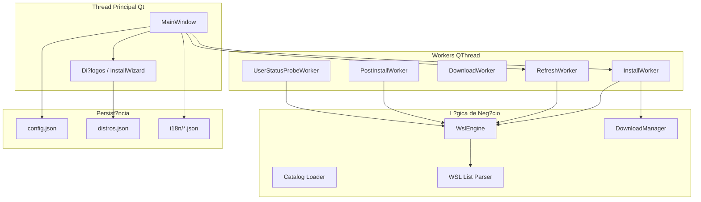

# WSL Manager Pro

[](https://github.com/wilkinbarban/WSL-Manager-Pro/actions/workflows/ci.yml)
[](https://www.gnu.org/licenses/gpl-3.0)
[](https://www.python.org/downloads/)
[](https://pypi.org/project/PySide6/)

> ?? Tamb?m dispon?vel em: [English](README.md) ? [Espa?ol](README_es.md)

Aplicativo de desktop para **Windows** que centraliza o gerenciamento do
**Subsistema Windows para Linux (WSL)**: listar distribui??es, instalar a
partir do cat?logo online ou de um rootfs baixado, importar/exportar,
provisionamento p?s-instala??o (conta de usu?rio, pacotes, `wsl.conf`),
limites de recursos via `.wslconfig` e utilit?rios de manuten??o.

**Vers?o do aplicativo:** 1.0.0

---

## ?ndice

- [Requisitos do Sistema](#requisitos-do-sistema)
- [Tecnologias](#tecnologias)
- [In?cio R?pido](#in?cio-r?pido)
- [Estrutura do Reposit?rio](#estrutura-do-reposit?rio)
- [Como o Aplicativo ? Executado](#como-o-aplicativo-?-executado)
- [Arquitetura e Fluxo de Dados](#arquitetura-e-fluxo-de-dados)
- [M?dulos do C?digo](#m?dulos-do-c?digo)
  - [Ponto de Entrada (`main.py`)](#ponto-de-entrada-mainpy)
  - [Pacote Core (`core/`)](#pacote-core-core)
  - [Pacote Utils (`utils/`)](#pacote-utils-utils)
  - [Pacote UI (`ui/`)](#pacote-ui-ui)
- [O Cat?logo `distros.json`](#o-cat?logo-distrosjson)
- [Configura??o Persistente](#configura??o-persistente)
- [Funcionalidades da Interface](#funcionalidades-da-interface)
- [Motor WSL (`WslEngine`)](#motor-wsl-wslengine)
- [Gerenciador de Downloads (`DownloadManager`)](#gerenciador-de-downloads-downloadmanager)
- [Threads de Trabalho (Qt)](#threads-de-trabalho-qt)
- [Internacionaliza??o (i18n)](#internacionaliza??o-i18n)
- [Observabilidade (Logging e Diagn?stico)](#observabilidade-logging-e-diagn?stico)
- [Privil?gios e Seguran?a](#privil?gios-e-seguran?a)
- [Build e Distribui??o](#build-e-distribui??o)
- [Desenvolvimento, Testes e CI](#desenvolvimento-testes-e-ci)
- [Roteiro](#roteiro)
- [Licen?a](#licen?a)

---

## Requisitos do Sistema

| Requisito | Detalhes |
|-----------|----------|
| **Sistema Operacional** | Windows 10 build 19041+ (suporte WSL 2) |
| **WSL** | `wsl.exe` acess?vel em `%SystemRoot%\System32\wsl.exe` |
| **PowerShell** | `pwsh.exe` (PS 7+) ou `powershell.exe` (PS 5.1) no PATH |
| **Python** | 3.10 ou superior (usa anota??es de tipo modernas: `list[str]`, `dict[str, str]`) |
| **Permiss?es** | Privil?gios de Administrador recomendados para opera??es WSL e winget. O app suporta modo limitado (somente leitura) se o usu?rio recusar a eleva??o. |

---

## Tecnologias

| ?rea | Tecnologia |
|------|------------|
| Linguagem | **Python 3.10+** |
| Framework GUI | **PySide6** (bindings oficiais Qt 6 para widgets) |
| Concorr?ncia UI | **QThread** + sinais/slots Qt |
| Cliente HTTP | **requests** (downloads com streaming, retentativas e suporte Range) |
| Compress?o | **zstandard** (bootstrap `.tar.zst` do Arch Linux ? evita depend?ncia do `tar --zstd` do sistema no Windows) |
| Formato de dados | **JSON** (`distros.json`, `config.json`, cat?logos i18n) |
| Integra??o do sistema | **subprocess** (`wsl.exe`, PowerShell, winget); **ctypes** (eleva??o UAC); **zipfile** / **tarfile** (manipula??o de arquivos) |
| Estiliza??o | Tema escuro via QSS (`resources/styles/dark.qss`) |

---

## In?cio R?pido

### Instalação com um único comando (PowerShell)

#### Opção A — Você já tem o reposit?rio clonado ou baixado

```powershell
Set-ExecutionPolicy -Scope Process -ExecutionPolicy Bypass -Force; .\install.ps1
```

#### Opção A2 — Bootstrap direto sem clonar (baixa + executa install.ps1)

```powershell
Set-ExecutionPolicy -Scope Process -ExecutionPolicy Bypass -Force; irm https://raw.githubusercontent.com/wilkinbarban/WSL-Manager-Pro/master/install.ps1 | iex
```

#### Opção B — Instalação remota segura (clona o repo na ?rea de Trabalho, depois delega ao install.ps1)

```powershell
Set-ExecutionPolicy -Scope Process -ExecutionPolicy Bypass -Force; irm https://raw.githubusercontent.com/wilkinbarban/WSL-Manager-Pro/master/install_secure.ps1 | iex
```

O `install_secure.ps1` baixa o repositório em `%USERPROFILE%\Desktop\WSL-Manager-Pro`
por padrão, verifica os arquivos críticos e delega ao `install.ps1` localmente para
a configura??o totalmente automatizada do ambiente.

### Instala??o Manual (alternativa cl?ssica)

```powershell
# 1. Clonar ou baixar o reposit?rio
git clone https://github.com/wilkinbarban/WSL-Manager-Pro.git
cd WSL-Manager-Pro

# 2. Criar e ativar um ambiente virtual
python -m venv .venv
.\.venv\Scripts\activate

# 3. Instalar depend?ncias de execu??o
pip install -r requirements.txt

# 4. Executar o aplicativo
python main.py
```

---

## Estrutura do Reposit?rio

```
WSL Manager Pro/
+-- main.py                     # Ponto de entrada: path, eleva??o, QApplication, MainWindow
+-- pyproject.toml              # Metadados, depend?ncias, configura??o ruff e pytest
+-- requirements.txt            # Depend?ncias de execu??o
+-- distros.json                # Cat?logo est?tico de distros (URLs, gerenciadores de pacotes, p?s-install)
+-- ROADMAP.md                  # Plano de desenvolvimento multif?sico (150+ tarefas)
+-- build.ps1                   # Gatilho de build PyInstaller (EXE ?nico)
+-- install.ps1                 # Instalador de ambiente de um clique
+-- wsl_manager_pro.spec        # Arquivo spec do PyInstaller
+-- wsl_manager_pro.rc          # Arquivo de recursos Windows (incorpora??o de ?cone)
?
+-- core/                       # L?gica de neg?cio
?   +-- __init__.py
?   +-- wsl_engine.py           # Fachada sobre wsl.exe, PowerShell, p?s-install, .wslconfig
?   +-- wsl_list_parser.py      # Parsers puros para sa?da wsl --list (test?veis sem WSL)
?   +-- downloader.py           # Downloads HTTP retom?veis + verifica??o de checksum
?   +-- catalog_loader.py       # Valida??o, carregamento e mesclagem remota de cat?logos
?   +-- constants.py            # Constantes de timeout, retentativa, chunk e limites de UI
?
+-- utils/                      # Servi?os transversais
?   +-- __init__.py
?   +-- config_manager.py       # Config JSON persistente
?   +-- app_logging.py          # Logger de arquivo rotativo
?   +-- i18n.py                 # i18n em tempo de execu??o (en/es/pt) com troca ao vivo
?   +-- diagnostic_bundle.py    # Gerador de pacote ZIP de diagn?stico
?   +-- worker_threads.py       # Workers QThread: refresh, install, download, etc.
?
+-- ui/                         # Interface gr?fica PySide6
?   +-- __init__.py
?   +-- main_window.py          # QMainWindow: abas, barra de ferramentas, workers, logging
?   +-- dialogs.py              # Di?logos modais + Assistente de Instala??o de 5 p?ginas
?   +-- icons.py                # ?cones de status program?ticos (c?rculos) para o Dashboard
?   +-- theme.py                # Constantes de cor centralizadas da UI
?   +-- tabs/
?       +-- __init__.py
?       +-- dashboard_tab.py    # Tabela de status de distros
?       +-- manage_tab.py       # Importar/exportar e a??es r?pidas
?       +-- settings_tab.py     # Caminhos, op??es de inicializa??o, limites WSL2
?
+-- resources/                  # Ativos empacotados
?   +-- i18n/
?   ?   +-- en.json             # Tradu??es em ingl?s (500+ chaves)
?   ?   +-- es.json             # Tradu??es em espanhol
?   ?   +-- pt.json             # Tradu??es em portugu?s (brasileiro)
?   +-- styles/
?       +-- dark.qss            # Folha de estilo escura Qt (~250 linhas)
?
+-- assets/                     # ?cones do aplicativo
?   +-- icon.ico
?   +-- icon.png
?
+-- tests/                      # Testes unit?rios (32 testes, n?o requerem WSL)
?   +-- __init__.py
?   +-- test_app_logging.py
?   +-- test_catalog_loader.py
?   +-- test_config_manager.py
?   +-- test_diagnostic_bundle.py
?   +-- test_dialogs.py
?   +-- test_downloader.py
?   +-- test_i18n.py
?   +-- test_wsl_engine.py
?   +-- test_wsl_list_parser.py
?
+-- docs/                       # Documentos de design
    +-- adrs/
        +-- 0001-qprocess-vs-subprocess.md
```

---

## Como o Aplicativo ? Executado

1. **Configura??o de path** ? `main.py` insere a raiz do projeto no
   `sys.path` para que os imports absolutos (`core`, `utils`, `ui`) funcionem
   independentemente do diret?rio de trabalho.
2. **Fallback venv** ? Se o PySide6 estiver ausente no interpretador atual,
   o script tenta relan?ar usando `.venv\Scripts\python.exe`.
3. **Verifica??o de depend?ncias** ? Detecta pacotes ausentes e exibe um
   di?logo de erro com comandos de instala??o.
4. **Inicializa??o Qt** ? Cria `QApplication`, aplica escala de fonte DPI,
   carrega a folha de estilo escura (`dark.qss`) e define o ?cone do app.
5. **Logging** ? `configure_logging()` anexa um handler rotativo em
   `%LOCALAPPDATA%\WSLManagerPro\logs\app.log`.
6. **Config e i18n** ? Carrega `ConfigManager` (salva automaticamente na
   migra??o de schema) e inicializa o gerenciador de idiomas.
7. **Eleva??o de admin** ? Se n?o estiver executando como administrador e a
   configura??o solicitar, pergunta ao usu?rio se deseja relan?ar elevado.
   Escolher "N?o" desativa `run_as_admin` e continua em modo limitado.
8. **MainWindow** ? Cria e exibe a janela principal.
9. **Loop de eventos** ? Entra em `app.exec()` at? que a janela seja fechada.

```powershell
python main.py
```

---

## Arquitetura e Fluxo de Dados



- A **UI nunca bloqueia** em opera??es longas ? todo trabalho pesado ?
  delegado a **workers QThread** que comunicam via sinais Qt.
- **`WslEngine`** ? o ?nico m?dulo que lan?a processos do SO. Decodifica
  sa?da (UTF-16 LE para metacomandos, UTF-8 para bash).
- **`DownloadManager`** suporta retomada HTTP, verifica??o de checksum e
  extra??o multi-formato (APPX, bootstrap Arch).
- **`Catalog Loader`** valida e mescla cat?logos locais + remotos.
- **`ConfigManager`** persiste configura??es, estados de download e registro
  de distros instalados.

---

## M?dulos do C?digo

### Ponto de Entrada (`main.py`)

Fun??es principais: `_is_admin()`, `_elevate_windows()`,
`_relaunch_with_workspace_venv()`, `_load_dark_stylesheet()`,
`_detect_missing_runtime_dependencies()`, `_resource_path()`, `main()`.

A fun??o `main()` executa uma inicializa??o de 13 etapas: app ID ? import
PySide6 ? QApplication ? verifica??o de depend?ncias ? escala de fonte ?
folha de estilo escura ? ?cone ? logging ? config ? i18n ? aviso de admin ?
MainWindow ? loop de eventos.

### Pacote Core (`core/`)

**`core/constants.py`** ? Constantes centralizadas de timeout, retentativa,
tamanho de chunk e limites de UI usadas por todos os m?dulos.

**`core/wsl_engine.py`** ? `WslEngine`: fachada de alto n?vel sobre `wsl.exe`,
winget, DISM e PowerShell.  Modelos de dados: `DistroInfo`, `OnlineDistro`.
Exce??es: `WslNotFoundError`, `WslCommandError`.  Opera??es de ciclo de vida
de distros (import/export/unregister/set-default/terminate/shutdown), execu??o
de comandos em tempo real (`run_command`/`run_command_as_root`), pipeline de
provisionamento p?s-instala??o (`build_post_install_steps`/`inject_post_install`)
compat?vel com apt/dnf/zypper/pacman/apk, e gera??o de `.wslconfig`.  Senhas
s?o escritas via arquivo tempor?rio dentro do convidado e exclu?das
imediatamente ap?s `chpasswd` ? nunca vis?veis via `ps`.

**`core/wsl_list_parser.py`** ? Fun??es puras (sem depend?ncia de subprocess):
`parse_wsl_list_verbose()` e `parse_wsl_list_online()`.  Tratam BOM UTF-16 LE,
cabe?alhos localizados (en/es/pt) e o marcador `*` de distro padr?o.

**`core/downloader.py`** ? `DownloadManager`: download HTTP com streaming,
retomada Range, at? 3 retentativas, callback de progresso, verifica??o de
checksum (SHA-256/SHA-512/MD5) e cancelamento cooperativo via `threading.Event`.
Tamb?m: `extract_appx()` para arquivos APPX/ZIP e `extract_arch_bootstrap()`
para `.tar.zst` (descompress?o zstandard ? reempacotamento como `tar.gz`).

**`core/catalog_loader.py`** ? Dataclass `CatalogLoadResult`.  `load_catalog()`
valida e mescla cat?logos de distros locais + remotos.  Entradas inv?lidas
s?o ignoradas com avisos.

### Pacote Utils (`utils/`)

**`utils/config_manager.py`** ? `ConfigManager`: JSON persistente em
`%APPDATA%\WSLManagerPro\config.json`.  Dataclass `AppConfig` com todas as
configura??es.  Migra??o de schema v1?v2 com salvamento autom?tico.  Modelos
`InstalledDistro` e `DownloadState`.  Valida??o estrita ao salvar, carregamento
tolerante com fallbacks.

**`utils/app_logging.py`** ? Handler de arquivo rotativo: 2 MB m?x, 5 backups,
codifica??o UTF-8.  Sanitiza??o de senhas por conven??o.

**`utils/i18n.py`** ? Singleton `I18nManager` com sinal Qt `language_changed`
para troca de idioma ao vivo.  Cadeia de fallback: idioma atual ? ingl?s ?
chave original.  Suporta `str.format(**kwargs)`.  Resolu??o de recursos
compat?vel com PyInstaller.

**`utils/diagnostic_bundle.py`** ? Gerador ZIP: `README.txt`, `log_tail.txt`,
`wsl_version.txt`, `wsl_status.txt`.  Sem segredos por design.

**`utils/worker_threads.py`** ? 12 classes worker QThread: `BaseWorker`,
`CancellableWorker`, `RefreshWorker`, `UserStatusProbeWorker`,
`WslCommandWorker`, `ExportWorker`, `ImportWorker`, `DownloadWorker`,
`PostInstallWorker`, `InstallWorker` (pipeline completo de 5 etapas +
alternativa `wsl_online`), `WslConfigWorker`, `WingetInstallWorker`.

### Pacote UI (`ui/`)

**`ui/main_window.py`** ? `MainWindow` (QMainWindow): barra de ferramentas
(Install, Refresh, Shutdown All, seletor de idioma), splitter de 3 abas +
console de log, temporizador de atualiza??o autom?tica (configur?vel,
m?nimo 15 s), constru??o de cat?logo de distros (mescla `wsl --list --online`
com metadados do `distros.json`), menu de contexto na tabela Dashboard, fluxo
completo do assistente de instala??o com suporte PowerShell externo para
distros legacy.  `closeEvent` finaliza processos rastreados.

**`ui/dialogs.py`** ? Di?logos modais: `UserCreationDialog` (nome de usu?rio
regex `^[a-z_][a-z0-9_-]{0,30}$`, senha = 4 caracteres, checkbox sudo),
`DirectoryDialog`, `SwapConfigDialog` e `InstallWizard` (fluxo guiado de 5
p?ginas: Sele??o de Distro ? Caminhos ? Conta de Usu?rio ? Resumo ?
Progresso).  Suporta salvar/carregar perfis e detec??o de distros interativos
legacy.

**`ui/icons.py`** ? F?brica program?tica de `QIcon` via `QPainter`: running
(verde), stopped (cinza), installing (laranja), default (azul).

**`ui/theme.py`** ? 9 constantes de cor nomeadas: `COLOR_TEXT`, `COLOR_MUTED`,
`COLOR_INFO`, `COLOR_SUCCESS`, `COLOR_WARNING`, `COLOR_ERROR`, `COLOR_ACCENT`,
`COLOR_STOPPED`, `COLOR_BG_PANEL`.

**`ui/tabs/`** ? Widgets de aba desacoplados (fase A do ROADMAP):
- `DashboardTab` ? Tabela de distros de 7 colunas com controles de cabe?alho.
- `ManageTab` ? Importar/exportar e bot?es de a??o r?pida.
- `SettingsTab` ? Caminhos, op??es de inicializa??o, limites WSL2, diagn?stico.

---

## O Cat?logo `distros.json`

Cat?logo JSON est?tico na raiz do projeto. Cada chave ? um ID interno de
distro (ex. `ubuntu-2404`):

| Campo | Tipo | Descri??o |
|-------|------|-----------|
| `display_name` | `string` | Nome leg?vel para a UI |
| `description` | `string` | Descri??o curta |
| `url` | `string` | URL de download do rootfs (obrigat?rio para m?todo `rootfs`) |
| `checksum_url` | `string?` | URL do arquivo de ?ndice de checksum |
| `checksum_file_pattern` | `string?` | Padr?o de nome no arquivo de checksum |
| `algo` | `string?` | Algoritmo de hash: `sha256`, `sha512`, `md5` |
| `pkg_manager` | `string?` | `apt`, `dnf`, `zypper`, `pacman`, `apk` |
| `sudo_group` | `string?` | `sudo` (Debian/Ubuntu) ou `wheel` (Fedora/Arch/Alpine) |
| `packages` | `string[]?` | Pacotes instalados durante p?s-install |
| `extract_type` | `string` | Formato: `tar.gz`, `tar`, `tar.xz`, `tar.zst`, `appx`, `zip` |
| `systemd` | `boolean?` | Se o suporte de boot systemd est? dispon?vel |
| `install_method` | `string` | `rootfs` (download + import) ou `wsl_online` (cat?logo Store) |
| `online_name` | `string?` | Nome exato em `wsl --list --online` |
| `legacy_non_interactive_disable` | `boolean?` | Marca distros que exigem primeiro boot interativo (Oracle, SUSE) |
| `winget_id` | `string?` | Identificador do Windows Package Manager (reservado) |
| `notes` | `string?` | Notas livres para o mantenedor |

**Distribui??es inclu?das:** Ubuntu 22.04/24.04 LTS, Debian 12, Fedora 40,
Alpine Linux 3.19, Arch Linux, AlmaLinux 9, SUSE Linux Enterprise 15 SP6,
Oracle Linux 9.5.

---

## Configura??o Persistente

**Arquivo:** `%APPDATA%\WSLManagerPro\config.json`

| Configura??o | Padr?o | Descri??o |
|-------------|--------|-----------|
| `language` | `"en"` | Idioma da UI (`en`, `es`, `pt`) |
| `install_dir` | `C:\WSL\Distros` | Diret?rio de instala??o padr?o |
| `download_dir` | `C:\WSL\Cache` | Diret?rio de cache de downloads |
| `remote_catalog_url` | `""` | URL opcional de cat?logo remoto |
| `run_as_admin` | `true` | Solicitar eleva??o ao iniciar |
| `check_for_updates` | `false` | Verificar atualiza??es ao iniciar (GitHub releases) |
| `memory_limit_gb` | `4` | Limite de mem?ria VM WSL 2 (1?256 GB) |
| `swap_size_gb` | `2` | Espa?o swap WSL 2 (0?128 GB) |
| `processors` | `2` | N?cleos CPU l?gicos para WSL 2 (1?256) |
| `localhost_forwarding` | `true` | Encaminhamento de portas Windows?WSL |
| `vm_idle_timeout_sec` | `60` | Tempo ocioso para desligamento autom?tico da VM |
| `auto_refresh_interval_sec` | `15` | Intervalo de atualiza??o do Dashboard |
| `wsl_version` | `2` | Vers?o WSL preferida (1 ou 2) |
| `diagnostic_log_tail_lines` | `200` | Linhas de log no ZIP de diagn?stico |
| `download_states` | `{}` | Metadados de retomada de downloads |
| `installed_distros` | `[]` | Registro de distros instalados por este app |

---

## Funcionalidades da Interface

### Barra de Ferramentas

- **Install** ? Abre o Assistente de Instala??o de 5 p?ginas.
- **Refresh** ? Atualiza a lista de distros.
- **Shutdown All** ? Executa `wsl --shutdown`.
- **Seletor de idioma** ? Alterna o idioma da UI ao vivo (en / es / pt).

### Aba Dashboard

- Tabela de 7 colunas: ?cone de status, nome, estado, vers?o WSL, marcador
  de padr?o, status do usu?rio, bot?o de a??o.
- Atualiza??o manual e autom?tica (intervalo configur?vel, m?nimo 15 s).
- Bot?o Re-scan User Status para sondar usu?rios padr?o.
- Menu de contexto: Set Default, Terminate, Export, Open Shell (user/root),
  Full System Update, Repair (condicional), Unregister.
- Estado vazio com Retry Detection quando WSL n?o est? dispon?vel.

### Aba Manage

- **Import:** caminho tar, nome WSL, diret?rio de instala??o ? `wsl --import`.
- **Export:** seletor de distro + caminho de salvamento ? `wsl --export`.
- **Quick Actions:** Set Default, Terminate, Shutdown All, Open Shell
  (user/root), Full System Update, Install via winget, Repair (Oracle/SUSE),
  Unregister, Deep Clean.

### Aba Settings

- Diret?rios padr?o de instala??o e download.
- Op??es de inicializa??o: executar como admin, verificar atualiza??es, URL
  do reposit?rio de atualiza??es.
- Limites de recursos WSL 2: mem?ria, swap, processadores, encaminhamento
  localhost, tempo ocioso da VM (toggle avan?ado).
- Bot?o **Apply & Write .wslconfig** (worker em segundo plano).
- Bot?o **Export Diagnostic Bundle** (ZIP com vers?o do app, final do log,
  `wsl --version`, `wsl --status`).
- Bot?o **Save Settings** (persiste em `config.json`).

### Assistente de Instala??o

- **P?gina 1** ? Selecionar distro do cat?logo mesclado (local + online).
- **P?gina 2** ? Configurar caminhos e nome WSL.
- **P?gina 3** ? Conta de usu?rio (opcional), atualiza??o do sistema,
  systemd, salvar/carregar perfil.
- **P?gina 4** ? Revis?o do resumo.
- **P?gina 5** ? Log de progresso ao vivo com transi??es de etapa
  (Download ? Extract ? Import ? Post-install ? Complete).

Para Oracle Linux e SUSE Enterprise (distros interativos legacy), o
assistente pode delegar para uma janela externa do PowerShell.

---

## Motor WSL (`WslEngine`)

- Resolve o caminho do `wsl.exe` de `System32`, `SysNative` ou `PATH`.
- Usa `CREATE_NO_WINDOW` em todos os subprocessos para evitar janelas de console.
- Decodifica sa?da com UTF-16 LE primeiro (metacomandos), depois UTF-8 (bash).
- Geradores de streaming (`_popen_stream`, `_popen_stream_checked`) para
  sa?da em tempo real.
- Timeouts expl?citos: 600 s para import/export, 300 s para set-version,
  120 s para valida??o de usu?rio, 20 s para sondagem de usu?rio.
- Suporta todos os subcomandos `wsl.exe`: import, export, unregister,
  set-default, set-version, terminate, shutdown, mount.

---

## Gerenciador de Downloads (`DownloadManager`)

- **Tamanho do chunk:** 128 KiB.
- **Retomada:** HTTP Range; auto-detecta tamanho do arquivo existente.
- **Retentativas:** at? 3 tentativas em erros de rede/IO.
- **Progresso:** callback `(bytes_done, total_bytes)`; `total_bytes` pode
  ser 0 se o servidor omitir `Content-Length`.
- **Cancelamento:** cooperativo via `threading.Event`.
- **HTTP 416:** tratado como "arquivo j? completo" ? verifica checksum se
  fornecido e retorna.
- **Extra??o de arquivos:** APPX (ZIP ? localizar rootfs tar) e bootstrap
  Arch (`.tar.zst` ? reempacotar como `tar.gz` simples).

---

## Threads de Trabalho (Qt)

Todos os workers herdam de `BaseWorker` (ou `CancellableWorker`) e executam
em `QThread`.  `MainWindow` mant?m refer?ncias em `_active_workers` para
evitar que o coletor de lixo destrua threads ativas.

Padr?o de comunica??o:

```
Worker thread  -- sinal --?  Slot da thread principal
----------------------------------------------------
log_message(str)        ? anexar ao console de log
error_occurred(str)     ? exibir erro no log + barra de status
progress(int, int)      ? atualizar barra de progresso
stage_changed(str)      ? atualizar r?tulo de status
finished_ok()           ? notificar conclus?o + limpeza
```

---

## Internacionaliza??o (i18n)

O aplicativo suporta **tr?s idiomas** com troca ao vivo (sem reinicializa??o):

| C?digo | Idioma | Arquivo |
|--------|--------|---------|
| `en` | English | `resources/i18n/en.json` |
| `es` | Espa?ol | `resources/i18n/es.json` |
| `pt` | Portugu?s (Brasil) | `resources/i18n/pt.json` |

**Caracter?sticas principais:**
- **Cadeia de fallback:** idioma atual ? ingl?s ? chave original.
- **Formata??o de strings:** `t("Baixado {pct}%", pct=75)`.
- **Troca ao vivo:** sinal Qt `language_changed` aciona `retranslate_ui()`
  em todas as abas e di?logos.
- **Compat?vel com PyInstaller** via `sys._MEIPASS`.
- **Degrada??o graciosa:** erros de parse JSON produzem cat?logos vazios
  (chaves usam fallback em ingl?s).

---

## Observabilidade (Logging e Diagn?stico)

### Logging

- **Arquivo rotativo:** `%LOCALAPPDATA%\WSLManagerPro\logs\app.log`
  (2 MB m?x, 5 backups, UTF-8).
- **Formato:** `YYYY-MM-DD HH:MM:SS | LEVEL | message`.
- **Configura??o idempotente:** `configure_logging()` pode ser chamado v?rias
  vezes; apenas um handler ? anexado.
- **Console de log UI:** suporta filtragem por palavra-chave, copiar tudo,
  copiar sele??o e codifica??o de cores HTML.
- **Seguran?a:** senhas nunca s?o registradas em opera??o normal (aplicado
  por conven??o em cada ponto de chamada).

### Pacote de Diagn?stico (ZIP)

Gerado pela aba Settings. Conte?do:
- `README.txt` ? Timestamp, vers?o do app, status dos comandos, aviso de
  privacidade.
- `log_tail.txt` ? ?ltimas N linhas do console de log (configur?vel).
- `wsl_version.txt` ? Sa?da de `wsl --version`.
- `wsl_status.txt` ? Sa?da de `wsl --status`.

Sem segredos por design. O README inclui um lembrete para revisar o conte?do
do log antes de compartilhar.

---

## Privil?gios e Seguran?a

- **Eleva??o de administrador:** o aplicativo pergunta se deseja relan?ar
  elevado ao iniciar. Se o usu?rio recusar, executa em modo limitado (somente
  leitura) e desativa a prefer?ncia `run_as_admin`.
- **Senhas Linux:** durante p?s-install, a senha ? escrita em um arquivo
  tempor?rio dentro do convidado e exclu?da imediatamente ap?s o `chpasswd`
  l?-la. Nunca ? vis?vel via `ps` nem registrada no console.
- **Valida??o de nome de usu?rio:** aplicada tanto na UI (`UserCreationDialog`)
  quanto no motor (`build_post_install_steps`) com a express?o regular
  `^[a-z_][a-z0-9_-]{0,30}$`.
- **Sem segredos hardcoded:** o c?digo n?o cont?m chaves de API, tokens ou
  credenciais fixas.

---

## Build e Distribui??o

### EXE ?nico (PyInstaller)

```powershell
.\build.ps1
```

Invoca o PyInstaller com `wsl_manager_pro.spec`, produzindo um
`WSLManagerPro.exe` independente em `dist/`.  O execut?vel inclui todos os
m?dulos Python (arquivo `.pyz`), `distros.json`, tradu??es
(`resources/i18n/*.json`), folha de estilo escura (`resources/styles/dark.qss`)
e o ?cone do aplicativo (`assets/icon.ico`, incorporado via `.rc`).

### Build Manual

```powershell
python -m PyInstaller --clean wsl_manager_pro.spec
```

---

## Desenvolvimento, Testes e CI

### Executar Testes

```bash
pip install -e ".[dev]"
pytest tests/ -q
```

Os **32 testes passam** sem exigir `wsl.exe` ? os parsers s?o fun??es puras
e os testes do downloader/engine usam mocks.

### Linting

```bash
ruff check core/ utils/ tests/ main.py
```

Ruff est? configurado em `pyproject.toml` (Python 3.10, linha de 100 caracteres).
O diret?rio `ui/` est? temporariamente exclu?do pendente de revis?o de estilo.

### Pipeline CI

Em cada push ou pull request para `main` ou `master`, o fluxo de CI:
1. Instala o projeto com o extra `dev`.
2. Executa `ruff check core utils tests`.
3. Executa `pytest`.

---

## Roteiro

Consulte [`ROADMAP.md`](ROADMAP.md) para o plano de desenvolvimento multif?sico
completo (150+ tarefas em 8 fases: refatora??o UI, ferramentas, observabilidade,
configura??o, privil?gios, UX, empacotamento e melhorias do motor).

---

## Licen?a

Este projeto est? licenciado sob a **GNU General Public License v3.0 (GPL-3.0)**.
Consulte o arquivo [LICENSE](LICENSE) para o texto completo.

Copyright (C) 2026 Contribuidores do WSL Manager Pro.

Este programa ? software livre: voc? pode redistribu?-lo e/ou modific?-lo sob os
termos da Licen?a P?blica Geral GNU publicada pela Free Software Foundation,
seja a vers?o 3 da Licen?a, ou (? sua escolha) qualquer vers?o posterior.
