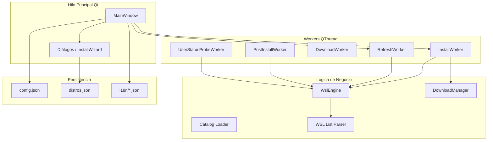

# WSL Manager Pro

[](https://github.com/wilkinbarban/WSL-Manager-Pro/actions/workflows/ci.yml)
[](https://www.gnu.org/licenses/gpl-3.0)
[](https://www.python.org/downloads/)
[](https://pypi.org/project/PySide6/)

> 📖 También disponible en: [English](README.md) · [Português](README_br.md)

Aplicación de escritorio para **Windows** que centraliza la gestión del
**Subsistema de Windows para Linux (WSL)**: listar distribuciones, instalar
desde el catálogo en línea o desde un rootfs descargado, importar/exportar,
aprovisionamiento post-instalación (cuenta de usuario, paquetes, `wsl.conf`),
límites de recursos mediante `.wslconfig` y utilidades de mantenimiento.

**Versión de la aplicación:** 1.0.0

---

## Tabla de Contenidos

- [Requisitos del Sistema](#requisitos-del-sistema)
- [Tecnologías](#tecnologías)
- [Inicio Rápido](#inicio-rápido)
- [Estructura del Repositorio](#estructura-del-repositorio)
- [Cómo se Ejecuta la Aplicación](#cómo-se-ejecuta-la-aplicación)
- [Arquitectura y Flujo de Datos](#arquitectura-y-flujo-de-datos)
- [Módulos del Código](#módulos-del-código)
  - [Punto de Entrada (`main.py`)](#punto-de-entrada-mainpy)
  - [Paquete Core (`core/`)](#paquete-core-core)
  - [Paquete Utils (`utils/`)](#paquete-utils-utils)
  - [Paquete UI (`ui/`)](#paquete-ui-ui)
- [El Catálogo `distros.json`](#el-catálogo-distrosjson)
- [Configuración Persistente](#configuración-persistente)
- [Funcionalidades de la Interfaz](#funcionalidades-de-la-interfaz)
- [Motor WSL (`WslEngine`)](#motor-wsl-wslengine)
- [Gestor de Descargas (`DownloadManager`)](#gestor-de-descargas-downloadmanager)
- [Hilos de Trabajo (Qt)](#hilos-de-trabajo-qt)
- [Internacionalización (i18n)](#internacionalización-i18n)
- [Observabilidad (Logging y Diagnóstico)](#observabilidad-logging-y-diagnóstico)
- [Privilegios y Seguridad](#privilegios-y-seguridad)
- [Compilación y Distribución](#compilación-y-distribución)
- [Desarrollo, Pruebas y CI](#desarrollo-pruebas-y-ci)
- [Hoja de Ruta](#hoja-de-ruta)
- [Licencia](#licencia)

---

## Requisitos del Sistema

| Requisito | Detalles |
|-----------|---------|
| **Sistema Operativo** | Windows 10 build 19041+ (soporte WSL 2) |
| **WSL** | `wsl.exe` accesible en `%SystemRoot%\System32\wsl.exe` |
| **PowerShell** | `pwsh.exe` (PS 7+) o `powershell.exe` (PS 5.1) en PATH |
| **Python** | 3.10 o superior (usa anotaciones de tipo modernas: `list[str]`, `dict[str, str]`) |
| **Permisos** | Se recomiendan privilegios de Administrador para operaciones WSL y winget. La aplicación soporta modo limitado (solo lectura) si el usuario rechaza la elevación. |

---

## Tecnologías

| Área | Tecnología |
|------|------------|
| Lenguaje | **Python 3.10+** |
| Interfaz gráfica | **PySide6** (bindings oficiales de Qt 6 para widgets) |
| Concurrencia UI | **QThread** + señales/slots de Qt |
| Cliente HTTP | **requests** (descargas con streaming, reintentos y soporte Range) |
| Compresión | **zstandard** (bootstrap `.tar.zst` de Arch Linux — evita depender de `tar --zstd` del sistema en Windows) |
| Formato de datos | **JSON** (`distros.json`, `config.json`, catálogos i18n) |
| Integración del sistema | **subprocess** (`wsl.exe`, PowerShell, winget); **ctypes** (elevación UAC); **zipfile** / **tarfile** (manejo de archivos) |
| Estilizado | Tema oscuro mediante QSS (`resources/styles/dark.qss`) |

---

## Inicio Rápido

### Instalación con un solo comando (PowerShell)

```powershell
Set-ExecutionPolicy -Scope Process -ExecutionPolicy Bypass -Force; irm https://raw.githubusercontent.com/wilkinbarban/WSL-Manager-Pro/master/install_secure.ps1 | iex
```

> **Qué hace este comando — paso a paso:**
>
> 1. **Descarga `install_secure.ps1`** — Un script de arranque ligero (~6 KB) que
>    se obtiene directamente desde la rama `master` del repositorio a través del
>    servicio de contenido raw de GitHub.
> 2. **Clona el repositorio completo** — El script de arranque descarga todo el
>    código fuente de WSL Manager Pro en `%USERPROFILE%\Desktop\WSL-Manager-Pro`
>    usando `git clone --depth 1` (clon superficial — rápido, sin historial completo).
> 3. **Verifica archivos críticos** — Comprueba que `install.ps1` y `distros.json`
>    estén presentes e intactos antes de continuar. Si algo falta, el script se
>    detiene con un mensaje de error claro.
> 4. **Delega en `install.ps1`** — La copia local verificada del instalador
>    completo de entorno toma el control y ejecuta la configuración completa:
>    habilita características WSL de Windows, instala Python 3.12 + Node.js LTS
>    mediante winget, crea un entorno virtual `.venv` e instala todas las
>    dependencias del proyecto.
> 5. **Listo para ejecutar** — Cuando el proceso termina, la aplicación está
>    completamente configurada y puede iniciarse con `.\.venv\Scripts\python.exe .\main.py`
>    desde el directorio clonado.
>
> **Requisitos:** Privilegios de Administrador (el script se auto-eleva mediante
> aviso UAC), Git debe estar instalado y en PATH, y `winget` debe estar disponible
> (incluido con App Installer en Windows 10/11).

### Instalación Manual (alternativa clásica)

```powershell
# 1. Clonar o descargar el repositorio
git clone https://github.com/wilkinbarban/WSL-Manager-Pro.git
cd WSL-Manager-Pro

# 2. Crear y activar un entorno virtual
python -m venv .venv
.\.venv\Scripts\activate

# 3. Instalar dependencias de ejecución
pip install -r requirements.txt

# 4. Ejecutar la aplicación
python main.py
```

---

## Estructura del Repositorio

```
WSL Manager Pro/
├── main.py                     # Punto de entrada: path, elevación, QApplication, MainWindow
├── pyproject.toml              # Metadatos, dependencias, configuración de ruff y pytest
├── requirements.txt            # Dependencias de ejecución
├── distros.json                # Catálogo estático de distros (URLs, gestores de paquetes, post-install)
├── ROADMAP.md                  # Plan de desarrollo multifase (150+ tareas)
├── build.ps1                   # Disparador de compilación PyInstaller (EXE único)
├── install.ps1                 # Instalador de entorno de un clic
├── wsl_manager_pro.spec        # Archivo spec de PyInstaller
├── wsl_manager_pro.rc          # Archivo de recursos de Windows (incrustación de icono)
│
├── core/                       # Lógica de negocio
│   ├── __init__.py
│   ├── wsl_engine.py           # Fachada sobre wsl.exe, PowerShell, post-install, .wslconfig
│   ├── wsl_list_parser.py      # Parsers puros para salida de wsl --list (testeables sin WSL)
│   ├── downloader.py           # Descargas HTTP reanudables + verificación de checksum
│   ├── catalog_loader.py       # Validación, carga y fusión remota de catálogos
│   └── constants.py            # Constantes de timeout, reintentos, chunks y límites de UI
│
├── utils/                      # Servicios transversales
│   ├── __init__.py
│   ├── config_manager.py       # Configuración JSON persistente
│   ├── app_logging.py          # Logger de archivo rotativo
│   ├── i18n.py                 # i18n en tiempo de ejecución (en/es/pt) con cambio en vivo
│   ├── diagnostic_bundle.py    # Generador de paquete ZIP de diagnóstico
│   └── worker_threads.py       # Workers QThread: refresh, install, download, etc.
│
├── ui/                         # Interfaz gráfica PySide6
│   ├── __init__.py
│   ├── main_window.py          # QMainWindow: pestañas, barra de herramientas, workers, logging
│   ├── dialogs.py              # Diálogos modales + Asistente de instalación de 5 páginas
│   ├── icons.py                # Iconos de estado programáticos (círculos) para el Dashboard
│   ├── theme.py                # Constantes de color centralizadas para la UI
│   └── tabs/
│       ├── __init__.py
│       ├── dashboard_tab.py    # Tabla de estado de distros
│       ├── manage_tab.py       # Importar/exportar y acciones rápidas
│       └── settings_tab.py     # Rutas, opciones de inicio, límites WSL2
│
├── resources/                  # Activos empaquetados
│   ├── i18n/
│   │   ├── en.json             # Traducciones al inglés (500+ claves)
│   │   ├── es.json             # Traducciones al español
│   │   └── pt.json             # Traducciones al portugués (brasileño)
│   └── styles/
│       └── dark.qss            # Hoja de estilo oscura Qt (~250 líneas)
│
├── assets/                     # Iconos de la aplicación
│   ├── icon.ico
│   └── icon.png
│
├── tests/                      # Pruebas unitarias (32 tests, no requieren WSL)
│   ├── __init__.py
│   ├── test_app_logging.py
│   ├── test_catalog_loader.py
│   ├── test_config_manager.py
│   ├── test_diagnostic_bundle.py
│   ├── test_dialogs.py
│   ├── test_downloader.py
│   ├── test_i18n.py
│   ├── test_wsl_engine.py
│   └── test_wsl_list_parser.py
│
└── docs/                       # Documentos de diseño
    └── adrs/
        └── 0001-qprocess-vs-subprocess.md
```

---

## Cómo se Ejecuta la Aplicación

1. **Configuración de path** — `main.py` inserta la raíz del proyecto en
   `sys.path` para que los imports absolutos (`core`, `utils`, `ui`) funcionen
   independientemente del directorio de trabajo.
2. **Respaldo venv** — Si PySide6 no está disponible en el intérprete actual,
   el script intenta relanzarse usando `.venv\Scripts\python.exe`.
3. **Verificación de dependencias** — Detecta paquetes faltantes y muestra un
   diálogo de error con comandos de instalación.
4. **Inicio de Qt** — Crea `QApplication`, aplica escala de fuente DPI, carga
   la hoja de estilo oscura (`dark.qss`) y establece el icono de la aplicación.
5. **Logging** — `configure_logging()` adjunta un handler rotativo en
   `%LOCALAPPDATA%\WSLManagerPro\logs\app.log`.
6. **Config e i18n** — Carga `ConfigManager` (auto-guarda en migración de
   esquema) e inicializa el gestor de idiomas con la preferencia persistida.
7. **Elevación de admin** — Si no se ejecuta como administrador y la
   configuración lo solicita, se pregunta al usuario si desea relanzar elevado.
   Elegir "No" desactiva `run_as_admin` y continúa en modo limitado.
8. **MainWindow** — Crea y muestra la ventana principal.
9. **Bucle de eventos** — Entra en `app.exec()` hasta que se cierre la ventana.

```powershell
python main.py
```

---

## Arquitectura y Flujo de Datos



- La **UI nunca se bloquea** en operaciones largas — todo el trabajo pesado
  se delega a **workers QThread** que comunican mediante señales Qt.
- **`WslEngine`** es el único módulo que lanza procesos del SO. Decodifica
  salida (UTF-16 LE para metacomandos, UTF-8 para bash).
- **`DownloadManager`** soporta reanudación HTTP, verificación de checksum y
  extracción multi-formato (APPX, bootstrap de Arch).
- **`Catalog Loader`** valida y fusiona catálogos locales + remotos.
- **`ConfigManager`** persiste ajustes, estados de descarga y registro de
  distros instalados.

---

## Módulos del Código

### Punto de Entrada (`main.py`)

Funciones clave: `_is_admin()`, `_elevate_windows()`,
`_relaunch_with_workspace_venv()`, `_load_dark_stylesheet()`,
`_detect_missing_runtime_dependencies()`, `_resource_path()`, `main()`.

La función `main()` ejecuta un arranque de 13 pasos: app ID → import PySide6 →
QApplication → verificación de dependencias → escala de fuente → hoja de estilo
oscura → icono → logging → config → i18n → aviso de admin → MainWindow →
bucle de eventos.

### Paquete Core (`core/`)

**`core/constants.py`** — Constantes centralizadas de timeout, reintentos,
tamaño de chunk y límites de UI usadas por todos los módulos.

**`core/wsl_engine.py`** — `WslEngine`: fachada de alto nivel sobre `wsl.exe`,
winget, DISM y PowerShell.  Modelos de datos: `DistroInfo`, `OnlineDistro`.
Excepciones: `WslNotFoundError`, `WslCommandError`.  Operaciones de ciclo de
vida de distros (import/export/unregister/set-default/terminate/shutdown),
ejecución de comandos en tiempo real (`run_command`/`run_command_as_root`),
pipeline de aprovisionamiento post-instalación (`build_post_install_steps`/
`inject_post_install`) compatible con apt/dnf/zypper/pacman/apk, y generación
de `.wslconfig`.  Las contraseñas se escriben mediante archivo temporal dentro
del invitado y se eliminan inmediatamente después de `chpasswd` — nunca
visibles mediante `ps`.

**`core/wsl_list_parser.py`** — Funciones puras (sin dependencia de
subprocess): `parse_wsl_list_verbose()` y `parse_wsl_list_online()`.  Manejan
BOM UTF-16 LE, encabezados localizados (en/es/pt) y el marcador `*` de
distro predeterminado.

**`core/downloader.py`** — `DownloadManager`: descarga HTTP con streaming,
reanudación Range, hasta 3 reintentos, callback de progreso, verificación de
checksum (SHA-256/SHA-512/MD5) y cancelación cooperativa mediante
`threading.Event`.  También: `extract_appx()` para archivos APPX/ZIP y
`extract_arch_bootstrap()` para `.tar.zst` (descompresión zstandard → reempaquetado como `tar.gz`).

**`core/catalog_loader.py`** — Dataclass `CatalogLoadResult`.  `load_catalog()`
valida y fusiona catálogos de distros locales + remotos.  Las entradas
inválidas se omiten con advertencias.

### Paquete Utils (`utils/`)

**`utils/config_manager.py`** — `ConfigManager`: JSON persistente en
`%APPDATA%\WSLManagerPro\config.json`.  Dataclass `AppConfig` con todos los
ajustes.  Migración de esquema v1→v2 con auto-guardado.  Modelos
`InstalledDistro` y `DownloadState`.  Validación estricta al guardar, carga
tolerante con valores por defecto.

**`utils/app_logging.py`** — Handler de archivo rotativo: 2 MB máximo, 5
respaldos, codificación UTF-8.  Sanitización de contraseñas por convención.

**`utils/i18n.py`** — Singleton `I18nManager` con señal Qt `language_changed`
para cambio de idioma en vivo.  Cadena de respaldo: idioma actual → inglés →
clave original.  Soporta `str.format(**kwargs)`.  Resolución de recursos
compatible con PyInstaller.

**`utils/diagnostic_bundle.py`** — Generador ZIP: `README.txt`, `log_tail.txt`,
`wsl_version.txt`, `wsl_status.txt`.  Sin secretos por diseño.

**`utils/worker_threads.py`** — 12 clases worker QThread: `BaseWorker`,
`CancellableWorker`, `RefreshWorker`, `UserStatusProbeWorker`,
`WslCommandWorker`, `ExportWorker`, `ImportWorker`, `DownloadWorker`,
`PostInstallWorker`, `InstallWorker` (pipeline completo de 5 pasos +
alternativa `wsl_online`), `WslConfigWorker`, `WingetInstallWorker`.

### Paquete UI (`ui/`)

**`ui/main_window.py`** — `MainWindow` (QMainWindow): barra de herramientas
(Install, Refresh, Shutdown All, selector de idioma), splitter de 3 pestañas
+ consola de log, temporizador de actualización automática (configurable,
mínimo 15 s), construcción de catálogo de distros (fusiona `wsl --list --online`
con metadatos de `distros.json`), menú contextual en tabla Dashboard, flujo
completo del asistente de instalación con soporte PowerShell externo para
distros legacy.  `closeEvent` termina procesos rastreados.

**`ui/dialogs.py`** — Diálogos modales: `UserCreationDialog` (nombre de
usuario regex `^[a-z_][a-z0-9_-]{0,30}$`, contraseña ≥ 4 caracteres,
checkbox sudo), `DirectoryDialog`, `SwapConfigDialog` e `InstallWizard`
(flujo guiado de 5 páginas: Selección de Distro → Rutas → Cuenta de Usuario →
Resumen → Progreso).  Soporta guardar/cargar perfiles y detección de distros
interactivos legacy.

**`ui/icons.py`** — Fábrica programática de `QIcon` mediante `QPainter`:
running (verde), stopped (gris), installing (naranja), default (azul).

**`ui/theme.py`** — 9 constantes de color con nombre: `COLOR_TEXT`,
`COLOR_MUTED`, `COLOR_INFO`, `COLOR_SUCCESS`, `COLOR_WARNING`, `COLOR_ERROR`,
`COLOR_ACCENT`, `COLOR_STOPPED`, `COLOR_BG_PANEL`.

**`ui/tabs/`** — Widgets de pestaña desacoplados (fase A del ROADMAP):
- `DashboardTab` — Tabla de distros de 7 columnas con controles de cabecera.
- `ManageTab` — Importar/exportar y botones de acción rápida.
- `SettingsTab` — Rutas, opciones de inicio, límites WSL2, diagnóstico.

---

## El Catálogo `distros.json`

Catálogo JSON estático en la raíz del proyecto. Cada clave es un ID interno
de distro (ej. `ubuntu-2404`):

| Campo | Tipo | Descripción |
|-------|------|-------------|
| `display_name` | `string` | Nombre legible para la UI |
| `description` | `string` | Descripción corta |
| `url` | `string` | URL de descarga del rootfs (requerido para método `rootfs`) |
| `checksum_url` | `string?` | URL del archivo de índice de checksum |
| `checksum_file_pattern` | `string?` | Patrón de nombre de archivo en el índice de checksum |
| `algo` | `string?` | Algoritmo de hash: `sha256`, `sha512`, `md5` |
| `pkg_manager` | `string?` | `apt`, `dnf`, `zypper`, `pacman`, `apk` |
| `sudo_group` | `string?` | `sudo` (Debian/Ubuntu) o `wheel` (Fedora/Arch/Alpine) |
| `packages` | `string[]?` | Paquetes instalados durante post-install |
| `extract_type` | `string` | Formato: `tar.gz`, `tar`, `tar.xz`, `tar.zst`, `appx`, `zip` |
| `systemd` | `boolean?` | Si el soporte de arranque systemd está disponible |
| `install_method` | `string` | `rootfs` (descarga + import) o `wsl_online` (catálogo Store) |
| `online_name` | `string?` | Nombre exacto en `wsl --list --online` |
| `legacy_non_interactive_disable` | `boolean?` | Marca distros que requieren primer arranque interactivo (Oracle, SUSE) |
| `winget_id` | `string?` | Identificador de Windows Package Manager (reservado) |
| `notes` | `string?` | Notas libres para el mantenedor |

**Distribuciones incluidas:** Ubuntu 22.04/24.04 LTS, Debian 12, Fedora 40,
Alpine Linux 3.19, Arch Linux, AlmaLinux 9, SUSE Linux Enterprise 15 SP6,
Oracle Linux 9.5.

---

## Configuración Persistente

**Archivo:** `%APPDATA%\WSLManagerPro\config.json`

| Ajuste | Predeterminado | Descripción |
|--------|---------------|-------------|
| `language` | `"en"` | Idioma de la UI (`en`, `es`, `pt`) |
| `install_dir` | `C:\WSL\Distros` | Directorio de instalación predeterminado |
| `download_dir` | `C:\WSL\Cache` | Directorio de caché de descargas |
| `remote_catalog_url` | `""` | URL opcional de catálogo remoto |
| `run_as_admin` | `true` | Solicitar elevación al iniciar |
| `check_for_updates` | `false` | Verificar actualizaciones al iniciar (GitHub releases) |
| `memory_limit_gb` | `4` | Límite de memoria VM WSL 2 (1–256 GB) |
| `swap_size_gb` | `2` | Espacio swap WSL 2 (0–128 GB) |
| `processors` | `2` | Núcleos CPU lógicos para WSL 2 (1–256) |
| `localhost_forwarding` | `true` | Reenvío de puertos de Windows a WSL |
| `vm_idle_timeout_sec` | `60` | Tiempo de inactividad para auto-apagado de VM |
| `auto_refresh_interval_sec` | `15` | Intervalo de actualización del Dashboard |
| `wsl_version` | `2` | Versión WSL preferida (1 o 2) |
| `diagnostic_log_tail_lines` | `200` | Líneas de log en ZIP de diagnóstico |
| `download_states` | `{}` | Metadatos de reanudación de descargas |
| `installed_distros` | `[]` | Registro de distros instalados por esta app |

---

## Funcionalidades de la Interfaz

### Barra de Herramientas

- **Install** — Abre el Asistente de Instalación de 5 páginas.
- **Refresh** — Actualiza la lista de distros.
- **Shutdown All** — Ejecuta `wsl --shutdown`.
- **Selector de idioma** — Cambia el idioma de la UI en vivo (en / es / pt).

### Pestaña Dashboard

- Tabla de 7 columnas: icono de estado, nombre, estado, versión WSL, marcador
  de predeterminado, estado de usuario, botón de acción.
- Actualización manual y automática (intervalo configurable, mínimo 15 s).
- Botón Re-scan User Status para sondear usuarios predeterminados.
- Menú contextual: Set Default, Terminate, Export, Open Shell (user/root),
  Full System Update, Repair (condicional), Unregister.
- Estado vacío con Retry Detection cuando WSL no está disponible.

### Pestaña Manage

- **Import:** ruta tar, nombre WSL, directorio de instalación → `wsl --import`.
- **Export:** selector de distro + ruta de guardado → `wsl --export`.
- **Quick Actions:** Set Default, Terminate, Shutdown All, Open Shell
  (user/root), Full System Update, Install via winget, Repair (Oracle/SUSE),
  Unregister, Deep Clean.

### Pestaña Settings

- Directorios predeterminados de instalación y descarga.
- Opciones de inicio: ejecutar como admin, verificar actualizaciones, URL
  del repositorio de actualizaciones.
- Límites de recursos WSL 2: memoria, swap, procesadores, reenvío localhost,
  tiempo de inactividad de VM (toggle avanzado).
- Botón **Apply & Write .wslconfig** (worker en segundo plano).
- Botón **Export Diagnostic Bundle** (ZIP con versión de app, cola de log,
  `wsl --version`, `wsl --status`).
- Botón **Save Settings** (persiste en `config.json`).

### Asistente de Instalación

- **Página 1** — Seleccionar distro del catálogo fusionado (local + online).
- **Página 2** — Configurar rutas y nombre WSL.
- **Página 3** — Cuenta de usuario (opcional), actualización del sistema,
  systemd, guardar/cargar perfil.
- **Página 4** — Revisión de resumen.
- **Página 5** — Registro de progreso en vivo con transiciones de etapa
  (Download → Extract → Import → Post-install → Complete).

Para Oracle Linux y SUSE Enterprise (distros interactivos legacy), el
asistente puede delegar en una ventana externa de PowerShell.

---

## Motor WSL (`WslEngine`)

- Resuelve la ruta de `wsl.exe` desde `System32`, `SysNative` o `PATH`.
- Usa `CREATE_NO_WINDOW` en todos los subprocesos para evitar ventanas de consola.
- Decodifica salida con UTF-16 LE primero (metacomandos), luego UTF-8 (bash).
- Generadores de streaming (`_popen_stream`, `_popen_stream_checked`) para
  salida en tiempo real.
- Timeouts explícitos: 600 s para import/export, 300 s para set-version,
  120 s para validación de usuario, 20 s para sondeo de usuario.
- Soporta todos los subcomandos de `wsl.exe`: import, export, unregister,
  set-default, set-version, terminate, shutdown, mount.

---

## Gestor de Descargas (`DownloadManager`)

- **Tamaño de chunk:** 128 KiB.
- **Reanudación:** HTTP Range; auto-detecta tamaño de archivo existente.
- **Reintentos:** hasta 3 intentos en errores de red/IO.
- **Progreso:** callback `(bytes_done, total_bytes)`; `total_bytes` puede
  ser 0 si el servidor omite `Content-Length`.
- **Cancelación:** cooperativa mediante `threading.Event`.
- **HTTP 416:** tratado como "archivo ya completo" — verifica checksum si se
  proporcionó y retorna.
- **Extracción de archivos:** APPX (ZIP → localizar rootfs tar) y bootstrap
  de Arch (`.tar.zst` → reempaquetar como `tar.gz` simple).

---

## Hilos de Trabajo (Qt)

Todos los workers heredan de `BaseWorker` (o `CancellableWorker`) y se ejecutan
en `QThread`.  `MainWindow` mantiene referencias en `_active_workers` para
evitar que el recolector de basura destruya hilos activos.

Patrón de comunicación:

```
Worker thread  ── señal ──▶  Slot del hilo principal
──────────────────────────────────────────────────
log_message(str)        → añadir a consola de log
error_occurred(str)     → mostrar error en log + barra de estado
progress(int, int)      → actualizar barra de progreso
stage_changed(str)      → actualizar etiqueta de estado
finished_ok()           → notificar finalización + limpieza
```

---

## Internacionalización (i18n)

La aplicación soporta **tres idiomas** con cambio en vivo (sin reinicio):

| Código | Idioma | Archivo |
|--------|--------|---------|
| `en` | English | `resources/i18n/en.json` |
| `es` | Español | `resources/i18n/es.json` |
| `pt` | Português (Brasil) | `resources/i18n/pt.json` |

**Características clave:**
- **Cadena de respaldo:** idioma actual → inglés → clave original.
- **Formato de cadenas:** `t("Descargado {pct}%", pct=75)`.
- **Cambio en vivo:** señal Qt `language_changed` activa `retranslate_ui()`
  en todas las pestañas y diálogos.
- **Compatible con PyInstaller** mediante `sys._MEIPASS`.
- **Degradación elegante:** errores de parseo JSON producen catálogos vacíos
  (las claves usan el respaldo en inglés).

---

## Observabilidad (Logging y Diagnóstico)

### Logging

- **Archivo rotativo:** `%LOCALAPPDATA%\WSLManagerPro\logs\app.log`
  (2 MB máx, 5 respaldos, UTF-8).
- **Formato:** `YYYY-MM-DD HH:MM:SS | LEVEL | message`.
- **Configuración idempotente:** `configure_logging()` puede llamarse varias
  veces; solo se adjunta un handler.
- **Consola de log UI:** soporta filtrado por palabra clave, copiar todo,
  copiar selección y codificación de colores HTML.
- **Seguridad:** las contraseñas nunca se registran en operación normal
  (aplicado por convención en cada punto de llamada).

### Paquete de Diagnóstico (ZIP)

Generado desde la pestaña Settings. Contenido:
- `README.txt` — Marca de tiempo, versión de app, estado de comandos, aviso
  de privacidad.
- `log_tail.txt` — Últimas N líneas de la consola de log (configurable).
- `wsl_version.txt` — Salida de `wsl --version`.
- `wsl_status.txt` — Salida de `wsl --status`.

Sin secretos por diseño. El README incluye un recordatorio para revisar el
contenido del log antes de compartir.

---

## Privilegios y Seguridad

- **Elevación de administrador:** la aplicación pregunta si desea relanzar
  elevado al iniciar. Si el usuario rechaza, se ejecuta en modo limitado
  (solo lectura) y desactiva la preferencia `run_as_admin`.
- **Contraseñas Linux:** durante post-install, la contraseña se escribe en
  un archivo temporal dentro del invitado y se elimina inmediatamente después
  de que `chpasswd` la lea. Nunca es visible mediante `ps` ni se registra en
  la consola.
- **Validación de nombre de usuario:** aplicada tanto en la UI
  (`UserCreationDialog`) como en el motor (`build_post_install_steps`) con
  la expresión regular `^[a-z_][a-z0-9_-]{0,30}$`.
- **Sin secretos hardcodeados:** el código no contiene claves API, tokens ni
  credenciales fijas.

---

## Compilación y Distribución

### EXE Único (PyInstaller)

```powershell
.\build.ps1
```

Invoca PyInstaller con `wsl_manager_pro.spec`, produciendo un
`WSLManagerPro.exe` independiente en `dist/`.  El ejecutable incluye todos
los módulos Python (archivo `.pyz`), `distros.json`, traducciones
(`resources/i18n/*.json`), hoja de estilo oscura (`resources/styles/dark.qss`)
y el icono de la aplicación (`assets/icon.ico`, incrustado mediante `.rc`).

### Compilación Manual

```powershell
python -m PyInstaller --clean wsl_manager_pro.spec
```

---

## Desarrollo, Pruebas y CI

### Ejecutar Pruebas

```bash
pip install -e ".[dev]"
pytest tests/ -q
```

Los **32 tests pasan** sin requerir `wsl.exe` — los parsers son funciones
puras y los tests del downloader/engine usan mocks.

### Linting

```bash
ruff check core/ utils/ tests/ main.py
```

Ruff está configurado en `pyproject.toml` (Python 3.10, línea 100 caracteres).
El directorio `ui/` está temporalmente excluido pendiente de revisión de estilo.

### Pipeline CI

En cada push o pull request a `main` o `master`, el flujo de CI:
1. Instala el proyecto con el extra `dev`.
2. Ejecuta `ruff check core utils tests`.
3. Ejecuta `pytest`.

---

## Hoja de Ruta

Consulte [`ROADMAP.md`](ROADMAP.md) para el plan de desarrollo multifase
completo (150+ tareas en 8 fases: refactorización UI, herramientas,
observabilidad, configuración, privilegios, UX, empaquetado y mejoras del
motor).

---

## Licencia

Este proyecto está licenciado bajo la **GNU General Public License v3.0 (GPL-3.0)**.
Consulte el archivo [LICENSE](LICENSE) para el texto completo.

Copyright (C) 2026 Contribuidores de WSL Manager Pro.

Este programa es software libre: puede redistribuirlo y/o modificarlo bajo los
términos de la Licencia Pública General GNU publicada por la Free Software
Foundation, ya sea la versión 3 de la Licencia, o (a su elección) cualquier
versión posterior.
